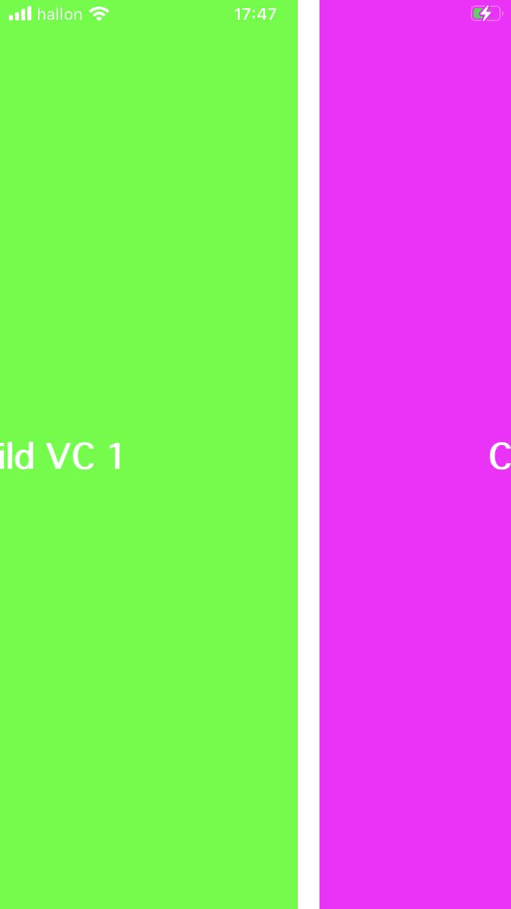

# Custom Container View Controller Transitions

Example on how to implement custom animated transitions between child view controllers in a custom container.
Note that we have implemented interactive transitions as well, using UIViewPropertyAnimator and by conforming to
 UIViewControllerInteractiveTransitioning (Note, that it is not possible to use UIPercentDrivenInteractiveTransition with child view controllers and interactive transitioniong.)

Basically, we have a main view controller. This VC has children. How can we use custom transitions between them?

From the original article:

"*The components of the iOS 7 custom view controller transition API are mostly protocols which make them extremely flexible to work with, because you can very easily plug them into your existing class hierarchy. The five main components are*:

* *Animation Controllers conforming to the UIViewControllerAnimatedTransitioning protocol and in charge of performing the actual animations.*

* *Interaction Controllers controlling the interactive transitions by conforming to the UIViewControllerInteractiveTransitioning protocol.*

* *Transitioning Delegates conveniently vending animation and interaction controllers, depending on the kind of transition to be performed.*

* *Transitioning Contexts defining metadata about the transition, such as properties of the view controllers and views participating in the transition. These objects conform to the UIViewControllerContextTransitioning protocol, and are created and provided by the system.*

* *Transition Coordinators providing methods to run other animations in parallel with the transition animations. They conform to the UIViewControllerTransitionCoordinator protocol.*

*As you know, from otherwise reading this publication, there are interactive and non-interactive transitions. In this article, we will concentrate on non-interactive transitions. These are the simplest, so they're a great place to start. This means that we will be dealing with animation controllers, transitioning delegates, and transitioning contexts from the list above.*"

[Our swift code is based on this objc code here from original article](https://www.objc.io/issues/12-animations/custom-container-view-controller-transitions/)

 iOS 10 gave us UIViewPropertyAnimator, and so we can use that in place of
 UIPercentDrivenInteractiveTransition(which would not work here, the app would crash).

 However, we can instead conform to UIViewControllerInteractiveTransitioning and drive the interactive
 transition by using a UIViewPropertyAnimator.
 
 A word of caution about the **UIViewControllerContextTransitioning** protocol.
 
  WARNING, Apple says we should not adopt this protocol for our own classes or directly creating objects that adopt this protocol. So we are treading on
 thin ice here. Though it works, things can and may break in the future.
 
 [Apple says:](https://developer.apple.com/documentation/uikit/uiviewcontrollercontexttransitioning)
 
 *Don’t adopt this protocol in your own classes, nor should you directly create objects that adopt this protocol. During a transition, the animator objects involved in that transition receive a fully configured context object from UIKit. Custom animator objects — objects that adopt the UIViewControllerAnimatedTransitioning or UIViewControllerInteractiveTransitioning protocol — should simply retrieve the information they need from the provided object.*

 *A context object encapsulates information about the views and view controllers involved in the transition. It also contains details about the how to execute the transition. For interactive transitions, the interactive animator object uses the methods of this protocol to report the animation’s progress. When the animation starts, the interactive animator object must save a pointer to the context object. Based on user interactions, the animator object then calls the updateInteractiveTransition(_:), finishInteractiveTransition(), or cancelInteractiveTransition() methods to report the progress toward completing the animation. Those methods send that information to UIKit so that it can drive the timing of the animations.*

